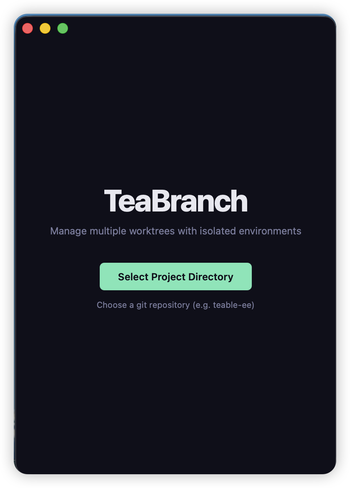
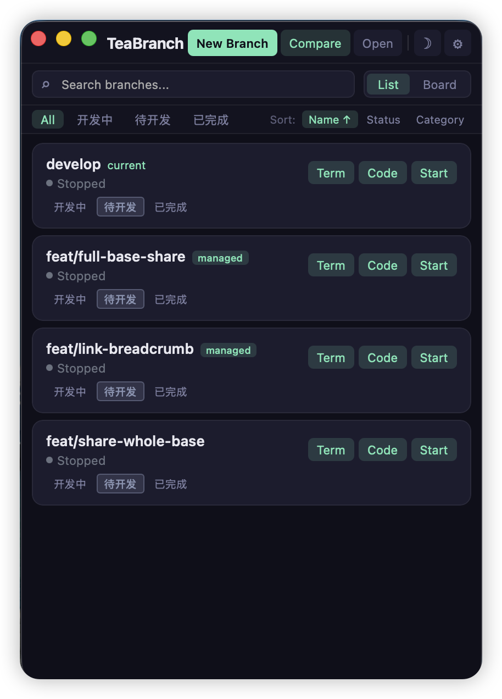

# TeaBranch

A lightweight macOS menubar app for managing parallel branch development environments for [Teable](https://github.com/teableio/teable), powered by **Git worktrees**. Built with [Tauri 2](https://v2.tauri.app/) + React + Rust.


<p align="center">
  
  
</p>

## What is TeaBranch?

Teable is a complex full-stack project — when developing multiple features simultaneously, switching branches and restarting services is slow and error-prone. TeaBranch solves this by using Git worktrees to let you run **multiple branches in parallel**, each with its own isolated dev server, port, database, and environment — all managed from a single menubar app.

### Key Features

- **One-click worktree creation** — Creates a Git worktree, generates isolated `.env` files, installs dependencies, and runs database migrations automatically
- **Parallel dev servers** — Start/stop dev servers for each branch independently with automatic port allocation
- **Live preview** — Open any running branch in the browser
- **Swim lane board** — Organize branches into "Developing", "Todo", and "Done" categories with drag-and-drop
- **System tray integration** — Lives in your menubar with right-click menu (Show / Quit)
- **Real-time logs** — View stdout/stderr for each branch's dev server with ANSI color support
- **Open in Terminal / VS Code** — Quickly jump into any worktree with your preferred terminal or editor
- **Kill Ports** — Force-kill all processes on a branch's ports and reset its status
- **Configurable terminal app** — Choose your preferred terminal (Warp, iTerm, Alacritty, etc.) from Settings
- **Dark / Light / System theme** — Three theme modes with smooth transitions
- **Isolated environments** — Each worktree gets its own ports, database, and Redis DB index

## Architecture

```
teabranch/
├── src/                     # React frontend
│   ├── components/
│   │   ├── App.tsx          # Main app shell with onboarding flow
│   │   ├── BranchList.tsx   # Branch list with filter/view modes
│   │   ├── BranchCard.tsx   # Individual branch card with controls
│   │   ├── SwimLaneBoard.tsx # Kanban-style board with drag-and-drop
│   │   ├── BranchDetail.tsx # Branch detail panel
│   │   ├── SettingsPanel.tsx # Settings dialog (terminal app config)
│   │   ├── LogViewer.tsx    # Real-time ANSI log viewer
│   │   ├── PreviewFrame.tsx # Embedded iframe preview
│   │   ├── SplitPreview.tsx # Side-by-side branch comparison
│   │   ├── CreateWorktreeDialog.tsx # Worktree creation wizard
│   │   ├── Onboarding.tsx   # First-run project selection
│   │   ├── CategoryPicker.tsx # Dev status category selector
│   │   ├── StatusBadge.tsx  # Running/stopped/building/error badge
│   │   └── AnsiLine.tsx     # ANSI escape code renderer
│   ├── hooks/
│   │   ├── useTheme.ts      # Theme management hook
│   │   └── useDevCategories.ts # Branch category persistence
│   ├── lib/
│   │   ├── commands.ts      # Tauri IPC command wrappers
│   │   └── types.ts         # TypeScript type definitions
│   └── styles/
│       └── global.css       # CSS variables for theming
├── src-tauri/               # Rust backend
│   ├── src/
│   │   ├── lib.rs           # Tauri app builder & plugin setup
│   │   ├── state.rs         # App state management (settings, environments, logs)
│   │   ├── tray.rs          # System tray icon, menu & click handler
│   │   ├── commands/
│   │   │   ├── git.rs       # Branch listing, worktree create/remove, open in terminal/vscode
│   │   │   ├── service.rs   # Dev server start/stop, port allocation, kill ports
│   │   │   └── settings.rs  # Project path & settings persistence
│   │   ├── git/
│   │   │   ├── branches.rs  # Git branch enumeration via git2
│   │   │   └── worktree.rs  # Full worktree lifecycle management
│   │   ├── process/
│   │   │   ├── manager.rs   # Child process spawning & cleanup
│   │   │   └── port.rs      # Available port finder
│   │   └── watcher/
│   │       └── file_watcher.rs # File system change monitoring
│   ├── Cargo.toml           # Rust dependencies
│   ├── tauri.conf.json      # Tauri window & bundle configuration
│   └── capabilities/
│       └── default.json     # Tauri permission capabilities
├── package.json
├── vite.config.ts           # Vite config with multi-page setup
└── tsconfig.json
```

## Tech Stack

| Layer    | Technology |
|----------|-----------|
| Framework | [Tauri 2](https://v2.tauri.app/) |
| Frontend | React 19, TypeScript 6, Vite 8 |
| Backend  | Rust (2021 edition) |
| Git      | [git2](https://crates.io/crates/git2) + CLI fallback |
| Process  | tokio async runtime |
| File watching | [notify](https://crates.io/crates/notify) |
| Plugins  | tauri-plugin-shell, tauri-plugin-dialog |

## Prerequisites

- **macOS** (primary target)
- **Rust** (latest stable) — [Install via rustup](https://rustup.rs/)
- **Node.js** >= 18
- **pnpm** >= 10 — `npm install -g pnpm`
- **Xcode Command Line Tools** — `xcode-select --install`

## Getting Started

### 1. Clone the repository

```bash
git clone git@github.com:caoxing9/branchpoilt.git
cd branchpoilt
```

### 2. Install dependencies

```bash
pnpm install
```

### 3. Run in development mode

```bash
pnpm tauri dev
```

This starts the Vite dev server on `http://localhost:1420` and launches the Tauri window.

### 4. Build for production

```bash
pnpm tauri build
```

The `.dmg` and `.app` bundle will be generated in `src-tauri/target/release/bundle/`.

## Usage

1. **Select a project** — On first launch, pick the Teable Git repository directory
2. **Browse branches** — All local branches are listed with their status
3. **Create worktree** — Click "New Branch" to create an isolated worktree for a branch
4. **Start a branch** — Click "Start" to spin up the dev server with isolated ports
5. **Open in Terminal / VS Code** — Click "Term" or "Code" to jump into the worktree
6. **Preview** — Click "Preview" to open the running branch in your browser
7. **Organize** — Switch to board view and drag branches between "Developing", "Todo", and "Done" lanes
9. **System tray** — Close the window to hide; click the tray icon to bring it back; right-click for Quit

## How Worktree Isolation Works

When you create a worktree through TeaBranch, it:

1. **Fetches** the latest from `origin/develop`
2. **Creates** a Git worktree in a sibling directory (`<repo>-worktree/<branch-name>`)
3. **Generates** a `.env.development.local` with unique ports (PORT, SOCKET_PORT, SERVER_PORT), a dedicated PostgreSQL database, and isolated Redis DB index
4. **Installs** dependencies via `pnpm install`
5. **Runs** database migrations

Each environment is fully isolated — no port conflicts, no shared databases.

## Configuration

Settings are persisted to the Tauri app data directory. You can also configure the terminal app from the Settings panel (gear icon in title bar).

| Setting | Default | Description |
|---------|---------|-------------|
| `projectPath` | — | Root Git repository path |
| `basePort` | `3100` | Starting port for allocation |
| `defaultStartCommand` | `pnpm dev` | Command to start dev servers |
| `terminalApp` | System Terminal | Preferred terminal app (Warp, iTerm, etc.) |

## Contributing

1. Fork the repository
2. Create your feature branch (`git checkout -b feature/amazing-feature`)
3. Commit your changes (`git commit -m 'Add amazing feature'`)
4. Push to the branch (`git push origin feature/amazing-feature`)
5. Open a Pull Request

## License

MIT
